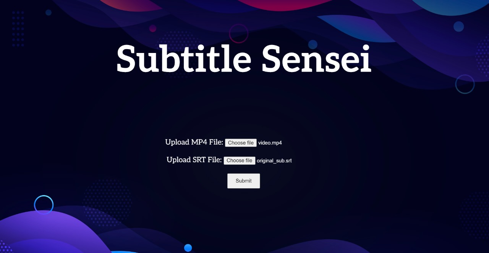

# SubtitleSensei

An awesome tool to fix your unsynced subtitle files to sync with the video!

## Set-up and use
1. Make sure Python is installed in your system.
2. Install the following Python libraries into your system:
 - flask
 - ffmpeg
 - PyTorch
 - Whisper
 - stable_whisper (https://github.com/jianfch/stable-ts)
 - pysrt
3. Download this repo as a zip file and extract the files into a folder.
4. From the folder, open the file 'websitetestbeckend.py' in any IDE and run the file.
4. Enter the localhost website link into your browser and the tool website will get loaded.
6. Upload your video file, subtitle file(having offset) and hit the 'Submit' button.
7. The corrected subtitle file will get downloaded into your system within few seconds.

## Screenshot(s)

